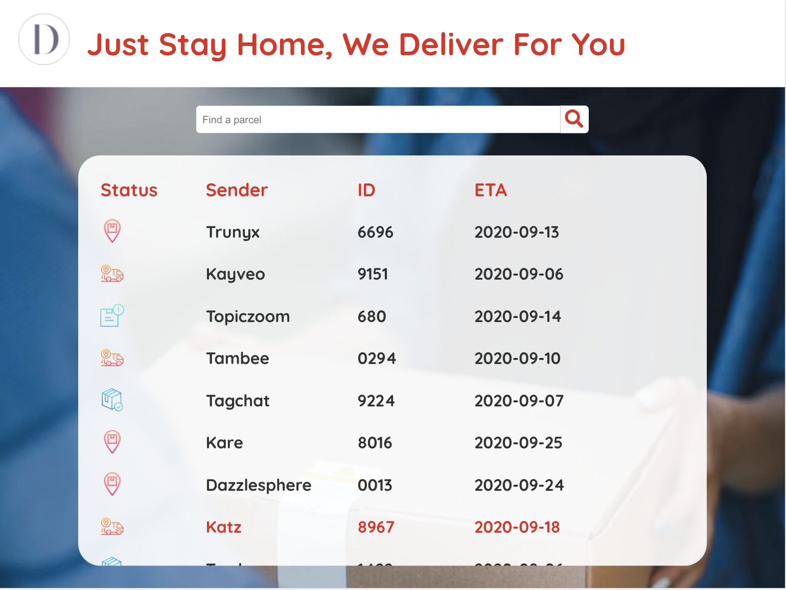
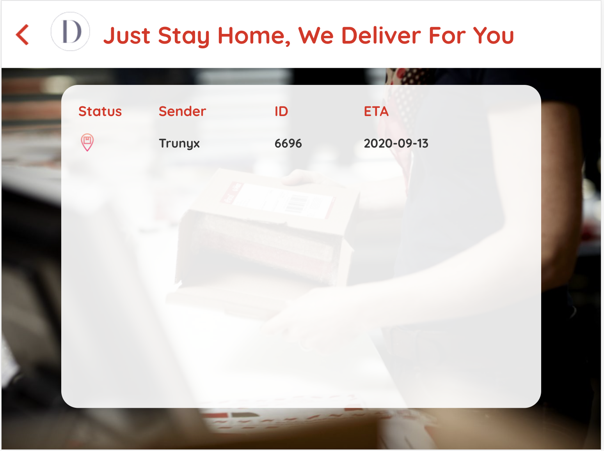
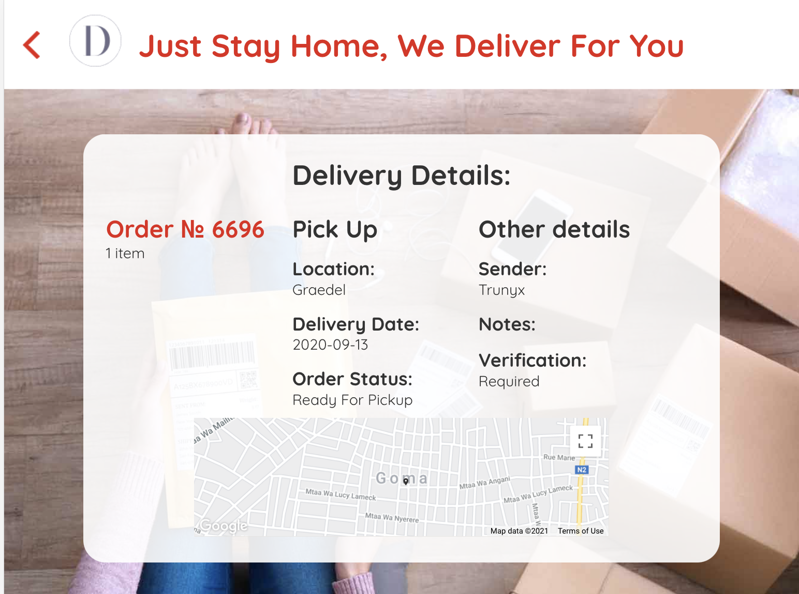

# Package Tracking Viewer Project

## Description
This project is a simple web app for our customers that displays a list of orders (or parcels)
with some details they need to know like order status, ETAs, pickup locations, etc.

You are welcome to visit the app online [online](https://sda-parcel-tracker.web.app/)

## Get started
### Dependencies
1. Node and npm;
2. React;
3. Recoil

### How to install
1. Clone the repository to any chosen folder in your computer with the following command in termainal:
   
   ```bash
   git clone https://github.com/OlgaPinchuk/parcel-tracker
   ```
2. To install dependencies open the terminal in the cloned folder and run the command

 ```bash
   npm i
   ```

3. To run the app run the command
```bash
   npm start
   ```
   It runs the app in the development mode.


## App overview

### Home page 
On the Home page you can see the list of parcels and search a parcel by sender, status or id.



### Search results page 
Here you can see the search result



### Parcel details page
On this page you can see the detailed info about the chosen parcel.

